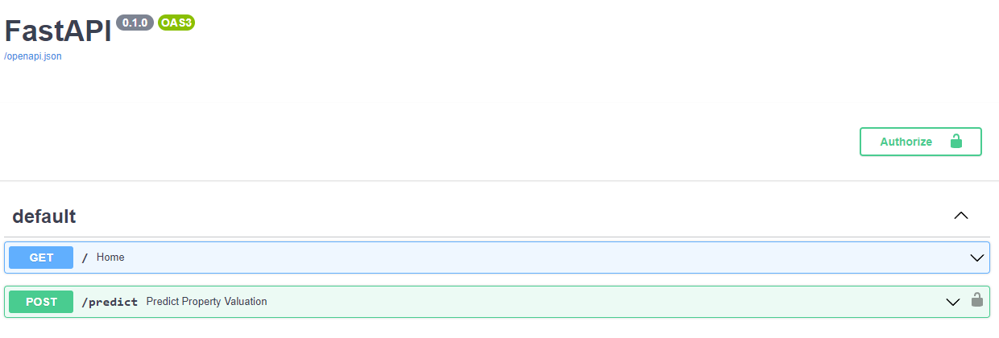
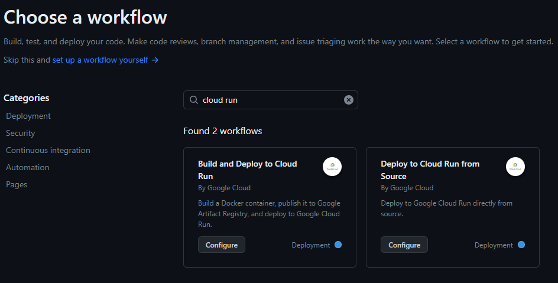
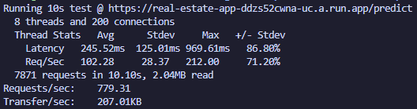

# Deploying Real Estate Valuation Prediction API on Google Cloud Run

This guide provides step-by-step instructions to train a Machine Learning model to estimate Real Estate prices for properties in Chile using a training pipeline and then deploying the model with an API as a containerized application. Everything in this project can be executed using Docker in a local environment and a free Google Cloud Platform account. We use Google Cloud Storage for storing the dataset and the trained model, and Google Cloud Run for deploying the API for online prediction. The training pipeline was built using `scikit-learn` and the API was developed using `FastAPI`. Let's dive in!

## Prerequisites

Before going forward, make sure you have the following (more detailed steps in the next sections):

- A Google Cloud Platform (GCP) account (the free tier is enough!)
- Project created on GCP
- Docker installed on your local machine
- GCP CLI (gcloud) installed on your local machine
- Google Artifact Registry enabled for your project
- Google Cloud Run enabled for your project
- Google Cloud Storage enabled for your project

## Hypothetical Scenario

You work for a team that has been assigned the task of developing a model to estimate property valuations for an important real estate client in Chile. The main objective of this task is to deliver a model into production, even if it's not the best one, so the team develops the required infrastructure to continue developing new models and projects in the future.

After some experimentation, the team has built a simple model that the client is happy with and wants to bring into production. The experiments code is available in a [Jupyter Notebook](Property-Friends-basic-model.ipynb), where a `GradientBoostingRegressor` is trained using a Pipeline that first preprocesses the features in the dataset and then trains the model.

The data used is not in this repo for security reasons, but let's assume you somehow aquired it. It consists of a `train.csv` file and a `test.csv` file, where each row consists of characteristics of a property like if it's a house or an apartment, the sector in the city where it's located, the property's area, number of rooms and bathrooms, etc. The target variable that we are trying to predict/estimate is the price of the property.

The Real Estate Valuation API is designed to accept properties details as input and return the estimated price.

## Training Pipeline

Now that we have the notebook with experiments as a starting point, we need to extract the logic into a more ordered structure. The notebook has the following structure:

1. Load the datasets
2. Define training features and target variable.
3. Preprocess features encoding the categorical variables.
4. Define Pipeline for applying categorical variables transformation and training the model.
5. Print model evaluation metrics.

We follow a similar structure but with some modifications:

1. We store the dataset files in Google Cloud Storage for secure access. These are not available to the public and you need to authenticate to access them. We also add the logic to be able to connect to a PostgreSQL DB to pull a full table into a Pandas DataFrame and then split it into train and test sets.
2. We add a GridSearchCV to the training pipeline to perform hyperparameter tuning on the model. This should help us getting a better version of the model using the best combination of hyperparameters in a given grid.
3. After training the model, we check if there is already a model uploaded to Google Cloud Storage. If there is currently no model, then we upload the current one. If there is a model already, we pull it and evaluate it using the same test set as the one we use with the new model. If the new model doesn't improve in any way the metrics, then we discard it and keep the old one. If it does improve the metrics, then we upload it to the storage and replace the old one.

The training pipeline has the following file structure:
```
├── training_pipeline
│   ├── model.py
│   ├── utils.py
│   ├── Dockerfile
│   └── requirements.txt
```
Where `model.py` has the main logic for running the training pipeline and `utils.py` has some helper functions to access Google Cloud Storage.

The pipeline requires some environment variables to be defined in order to be executed correctly. These can be defined in a `.env` file in the `./training_pipeline` folder. These are the env variables:

```Properties
# name of the project you created, e.g. mlops-real-estate
GCP_PROJECT_NAME=
# JSON with the credentials to authenticate to GCP
GOOGLE_APPLICATION_CREDENTIALS=
# name of the bucket where the datasets and the model are stored, e.g. mlops-real-estate-storage
STORAGE_BUCKET_NAME=
# path inside the bucket where the train data file is stored, e.g. data/train.csv
TRAIN_SET_PATH=
# path inside the bucket where the test data file is stored, e.g. data/test.csv
TEST_SET_PATH=
# path inside the bucket where the joblib model file is stored, e.g. models/estimator_pipeline.joblib
MODEL_PATH=
# flag to indicate if the datasource are the csv files or a database, e.g. files
DATASET_SOURCE=
# JSON with the connection parameters to connect to a PostgreSQL DB
DB_CREDENTIALS=
```
So now that we know how the pipeline works, we have to set up Google Cloud Storage and upload the datasets to that the pipeline can run and upload the model.

### Using Google Cloud Storage

Google Cloud Storage is a RESTful online file storage web service for storing and accessing data on Google Cloud Platform infrastructure. The service combines the performance and scalability of Google's cloud with advanced security and sharing capabilities.

There are plenty of tutorials and articles online explaining how to create a GCP account and using the free tier services, so we won't go into much detail about that. Basically what we need is:

1. Create an account.
2. Create a new project.
3. Enable the Cloud Storage API and create a new bucket.
4. Upload the csv files there.
5. Get your own GCP ADC Credentials JSON file (you can follow this [link](https://www.smartlab.at/use-google-cloud-storage-in-python-to-backup-and-load-your-ai-ml-data/) to see how to do it). Basically you can use `gcloud auth application-default login` in the GCP CLI and the file will get generated in your local machine. The env variable mentioned earlier called `GOOGLE_APPLICATION_CREDENTIALS` has to have the content of the generated JSON in a single line as a JSON string.

## Running Training Pipeline with Docker

So after everything is set up, let's run the pipeline! For this we'll be using Docker to package all that's necessary for the pipeline to work. The great thing about Docker is that we can containerize applications and scripts so that they can run anywhere. We have defined a Dockerfile with the following structure:
```Dockerfile
# Use an official Python runtime as the base image
FROM python:3.9-slim-buster

# Set the working directory in the container
WORKDIR /training_pipeline

# Copy the requirements file into the container
COPY requirements.txt requirements.txt

# Install the Python dependencies
RUN pip install --upgrade pip
RUN pip install -r requirements.txt

# Copy the training pipeline code into the container
COPY ./model.py /training_pipeline
COPY ./utils.py /training_pipeline

# Run the training script
CMD ["python", "-m", "model"]
```
In summary, this script copies the training pipeline logic, installs the necessary Python packages and finally it runs the script for training the model.

Then we can build a Docker Image using the command:
```shell
docker build -t training-pipeline:latest .
```
After building the image, we are ready to run the training pipeline locally with Docker. It's important to either define the env variables in the terminal or in the `.env` file, and then passing these to Docker when running the container. We can run it with the following command:
```shell
docker run --env-file .env training-pipeline
```
If everything goes smoothly, we should end up with a joblib file with the pipelined model in our bucket in GCS. Hooray!

### What could we improve?

There are plenty of things we could improve with the approach we followed. Currently we are using Google Cloud Storage for storing a static model file, and we are not storing any info or metadata about the training process. This works in a simple exercise but in a production environment with dozens of models and different projects, it's not so good. We could use a MLOps platform like MLFlow, Weights & Biases or Iguazio for model and experiment tracking and versioning. These platforms can help to keep track of every experiment we run with our training pipeline, storing evaluation metrics, training time, etc. They also expose APIs to get the current version of a model, or even a previous one.

Another important improvement we could do is to use an orchestration tool like Apache Airflow for automatic periodical training. Maybe we want to execute the training pipeline automatically at the start of each week using new data? We could schedule this with a DAG in Airflow. Maybe we want to detect any time there is new data uploaded to Cloud Storage, train a new model and compare it with the current one? We could also do that.

## Building Estimator API with FastAPI

FastAPI is a modern, fast (high-performance), web framework for building APIs with Python 3.7+ based on standard Python type hints. FastAPI's syntax is simple and fast to use, although we have to consider it doesn't come integrated with a webserver. It is specifically designed to build APIs. So for serving the APIs, it's common to use uvicorn which is a lightning-fast ASGI server implementation.

So now that we have our training pipeline defined and we have already created a model, we have to set up our estimator API to be able to make property valuations. Our code for this is pretty simple, it has the following structure:
```
├── app
│   ├── app.py
│   ├── auth.py
│   ├── config.py
│   ├── utils.py
│   ├── test_app.py
│   ├── Dockerfile
│   └── requirements.txt
```
The main logic is defined in [`app/app.py`](./app/app.py) and it's split in different modules. It could be divided in these steps:

1. Define a logger helper to store relevant information like the requests the API gets and the predictions results. When the app is running, it generates a `model.log` file that would look like this:
```log
2023-07-16 15:06:50,623 - INFO - Received a request - {'type': 'casa', 'sector': 'vitacura', 'net_usable_area': 152.0, 'net_area': 257.0, 'n_rooms': 3.0, 'n_bathroom': 3.0, 'latitude': -33.3794, 'longitude': -70.5447}
2023-07-16 15:06:50,629 - INFO - Prediction result - 22000
2023-07-16 15:09:13,974 - INFO - Received a request - {'type': 'casa', 'sector': 'vitacura', 'net_usable_area': 152.0, 'net_area': 257.0, 'n_rooms': 3.0, 'n_bathroom': 3.0, 'latitude': -33.3794, 'longitude': -70.5447}
2023-07-16 15:09:13,978 - INFO - Prediction result - 22000
2023-07-16 15:09:13,988 - INFO - Received a request - {'type': 'house', 'sector': 'residential', 'net_usable_area': 152.0, 'net_area': 257.0, 'n_rooms': 3.0, 'n_bathroom': 3.0, 'latitude': -33.3794, 'longitude': -70.5447}
2023-07-16 15:09:13,992 - INFO - Prediction result - 10379
```
2. Get the model from Google Cloud Storage. For this we use pretty much the same logic defined in the training pipeline for downloading the file from GCS.
3. Define the schema for the input and output for the requests to the API.
4. Lock the prediction endpoint using basic authentication via API Keys. This means only someone with a valid API Key can make requests to the `/predict` endpoint. In this exercise we are only using a valid API Key as a string in an env variable that has to be passed to the app before running it. Then it's necessary to send the API Key as a header in the request to be able to make predictions.
5. Define the endpoints in our app. There is a dummy `/` endpoint that sends a GET and gets a message from the app, and then there is the `/prediction` endpoint that receives the information of a property and returns the estimated valuation.
6. We also added some unit tests to test the app. These can be executed using `pytest` to validate the correct behaviour of the app.

And that's it! Technicaly, just having the code and running `uvicorn` would be enough to get the app up and running (try it by yourself by going to the `/app` folder and run `uvicorn app:app --reload` in your computer), but we will be running this locally in a better way by doing it with Docker.

## Deploying the API with Docker

Before building the Docker Image, it's necessary to define env variables but now for the app. These can be defined in a `.env` file in the `./app` folder. These are the env variables:

```Properties
# name of the project you created, e.g. mlops-real-estate
GCP_PROJECT_NAME=
# JSON with the credentials to authenticate to GCP
GOOGLE_APPLICATION_CREDENTIALS=
# name of the bucket where the datasets and the model are stored, e.g. mlops-real-estate-storage
STORAGE_BUCKET_NAME=
# path inside the bucket where the joblib model file is stored, e.g. models/estimator_pipeline.joblib
MODEL_PATH=
# API Key to be able to authenticate and make requests to the prediction endpoint, e.g. thisisabadapikey123
API_KEY=
```
The script for creating the image with the app can be used locally but more importantly, it can be used to build, publish and deploy the Docker image to Google Cloud Run and make a scalable app. In this case, our Dockerfile looks like this:
```Dockerfile
# Start from a base image
FROM python:3.9-slim-buster

# Set the working directory
WORKDIR /app

# Copy the requirements file into the container
COPY requirements.txt requirements.txt

# Install the required packages
RUN pip install --upgrade pip
RUN pip install -r requirements.txt

# Copy the application code into the container
COPY ./app.py /app
COPY ./auth.py /app
COPY ./config.py /app
COPY ./utils.py /app
COPY ./test_app.py /app

# Expose the app port
EXPOSE 8080

# Run command
CMD ["uvicorn", "app:app", "--host", "0.0.0.0", "--port", "8080"]
```
Then we can build the Docker Image using the command:
```shell
docker build -t property-prediction-api:latest .
```
After building the image, we are ready to run the app locally with Docker. It's important to either define the env variables in the terminal or in the `.env` file, and then passing these to Docker when running the container. We can run it with the following command:
```shell
docker run --env-file .env -p 8080:8080 property-prediction-api
```
If everything goes smoothly, we should end up with a deployed FastAPI app and be able to see it in our browser. Double Hooray!!

If you go to `http://localhost:8080/docs` you should see the documentation for the API: 



### What could we improve?

So now we have a simple app to make predictions, but there's also many things that we could improve here. For example, improve the security of our app with something better than API Keys like OAuth2, JWT, or something else. Thse could help to make user authentication and keep track of who is using our app.

## GitHub Actions Workflow to Run the Training Pipeline and Deploy the API to Google Cloud Run

So now we have two Docker images that we can run to train a model and then deploying an app locally, great. But, how could we deploy both of these into a production environment on the Cloud? We could use GitHub Actions and Google Cloud Run!

GitHub Actions is a continuous integration and continuous delivery (CI/CD) platform that allows you to automate your build, test, and deployment pipeline. You can create workflows that build and test every pull request to your repository, or deploy merged pull requests to production ([read more here](https://docs.github.com/en/actions/learn-github-actions/understanding-github-actions)). It's a great platform to automate build and deploy processes and it has multiple templates we can use directly in our repos.

On the other hand, Cloud Run is a managed compute platform that lets you run containers directly on top of Google's scalable infrastructure ([read more here](https://cloud.google.com/run/docs/overview/what-is-cloud-run)). It's a great tool for building services without worrying too much on infrastructure and scalability, because Google takes care of that for you depending on the load your app has.

The GitHub Actions workflow we use in this project will whenever there is a commit or push to the `main` branch. It's based on a template that's easy to find in the `Actions` templates GitHub offers. Just have to go to your repo, go to Actions and search for: "Build and Deploy to Cloud Run":



This workflow will follow the next steps:
1. Define several env variables.
2. Pull the code of the repo.
3. Authenticate to Google Cloud.
4. Build the training pipeline Docker container image and push it to Artifact Registry.
5. Run the container with the training pipeline.
6. Build the FastAPI app container and run unit tests. If everything's OK, push image to Artifact Registry
7. Deploy the app container to Cloud Run and return the URL of the deployed app.

There are some env variables and secrets that have to be set up and one important thing to consider, in the beginning of the workflow there is a very relevant commented chunk of code. Please follow those steps to set everything correctly, and maybe look at the working workflow in this repo. These steps are important mainly because they describe the necessary permissions that have to be set to be able to access all the GCP resources.

Given that in our code we used env variables to make everything work, we have to define them in our GitHub Actions workflow so that it can execute correctly. Most of them can be defined inside the code because they are not sensitive information, but there are some like the `API Key` or the `GOOGLE_APPLICATION_CREDENTIALS` that should not be exposed. GitHub has a nice feature that lets us define Secrets that we can use later in the workflow. There are four secrets that should be defined:

- ADC -> the GOOGLE_APPLICATION_CREDENTIALS JSON string
- API_KEY
- WIF_PROVIDER -> this is the provider defined in GCP, looks like this: `projects/123456789/locations/global/workloadIdentityPools/my-pool/providers/my-provider` (follow [this guide](https://github.com/google-github-actions/auth#setting-up-workload-identity-federation))
- WIF_SERVICE_ACCOUNT -> the service account created to access the GCP resources, looks like this: `my-service-account@my-project.iam.gserviceaccount.com` (follow [this guide](https://github.com/google-github-actions/auth#setting-up-workload-identity-federation))

After this workflow runs, we should end up with a deployed Cloud Run app, something like this: `https://real-estate-app-ddzs52cwna-uc.a.run.app/docs`. Triple Hooray!!!
### What could we improve?

We now have a full workflow to train a model and deploy an API into Cloud Run, but there are many things we could do better. Right now we have only defined 1 single Cloud Run service, but what if this is not enough for all the load that our app will receive in production? We could set up horizontal scaling to deploy more than 1 Cloud Run Service and add load balancing between services. We could also use other services like Kubernetes.

Another improvement is to remove the use of env variables across the project and instead use Google Secret Manager to store sensitive data.

## Run Load Test on the Deployed Cloud Run App using wrk

Once the API is deployed on Cloud Run, you can run load tests to evaluate its performance and scalability. One way to perform these kinds of tests is using [`wrk`](https://github.com/wg/wrk). wrk is a modern HTTP benchmarking tool capable of generating significant load when run on a single multi-core CPU.

A [`request.lua`](./request.lua) LUA script file is included in this repo, which simply defines the POST request body and header to send to the deployed API. In the body we send an example with the relevant features that the trained model accepts and uses to make the prediction. It's important to set the value of the env variable `API_KEY` with the same as the one used to deploy the app so that we can authenticate. The steps to run the load test are:

1. Install `wrk` on your local machine.
2. Run `wrk -t8 -c200 -d10s -s ./tests/request.lua https://real-estate-app-ddzs52cwna-uc.a.run.app/predict`, where:
    * `-t8` represents 8 threads.
    * `-c200` represents using 200 HTTP connections open.
    * `-d10s` represents the test duration.

Here are the results for a test I ran using my local machine using 8 threads and 200 connections:



The output shows the normal distribution parameters for the latency and the request per second statistics. We can see that the latency is high, but at least is less than 1s. The Stdev is pretty high so the Avg is not that trustworthy. The main goal to improve this would be to reduce the latency and increase the Req/Sec ratio. One way to achieve this using our current solution would be to modify the deployment workflow so that we use more than 1 Cloud Run Service, so that we do horizontal scaling and distribute the traffic with a load balancer. Another solution would be to increase the resources of the current service to scale vertically. It's also important to check the code of the app and see what could be done in a more efficient way.

### Any other improvements?

* Use Terraform to build infrastructure using code.
* Add a GitHub Actions workflow to do a clean up of the Google Cloud Resources used in this project.
